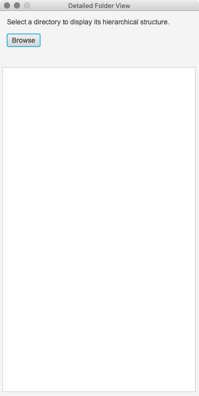
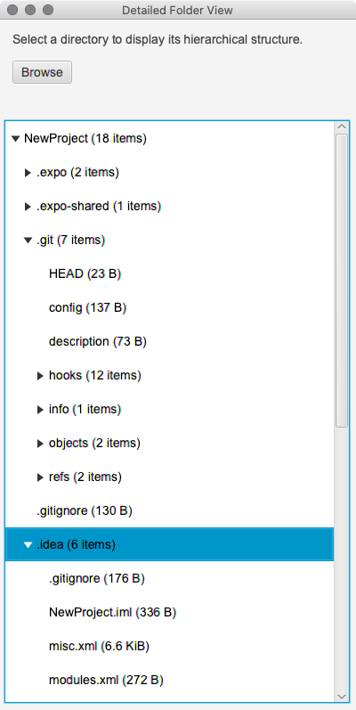

# Detail Directory Viewer

## Overview
This is a Java program that reads the file system beneath a specific folder/directory and stores it in a tree data structure. 

## What does this program do?
The program should be able to look at a folder/directory and its tree of subfolders to construct a tree data structure to represent it. Each node in the tree corresponds to a folder in the file system and should contain the number of files, the total size of the files, the folder's name, and a list of child folders.

The program should read the name of the folder to scan, scan the folder's subtree, then output the tree in a way that shows the tree hierarchy (e.g., one line per tree node with each node properly indented).

## System requirements
The program is a JavaFX application using version 8 of Amazon's distribution of the Open Java Development Kit (OpenJDK) [Corretto 8](https://aws.amazon.com/corretto/), which includes JavaFX 8.

## How to use this program.
The program requires no user interaction other than compilation and execution.

The GUI consists of a single stage (window) and a single scene (window content). Once the user selects a folder/directory to parse, the resulting structure will appear in the TableVIew.

After the results are displayed, the user may load another folder/directory to parse.

## Installation.
Clone the repo and import it into your favorite Java IDE. Make sure that:
 1. The project SDK is Java 8 with project language level 8, and
 2. JavaFX 8 is installed in your system.

## Known Issues
The resulting directory tree is not sorted.

## Todo
Figure out how to sort the directory tree.

## Screenshots
### Initial prompt

### Results

